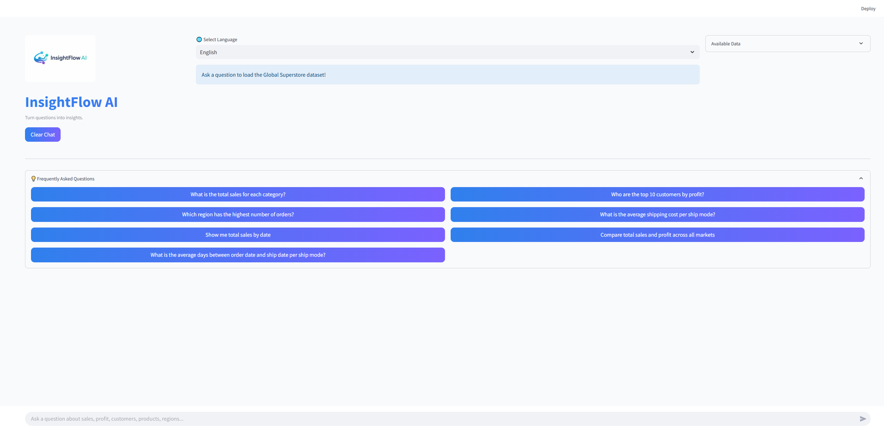
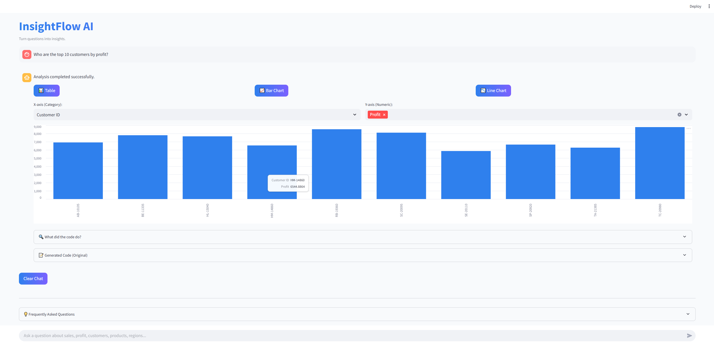
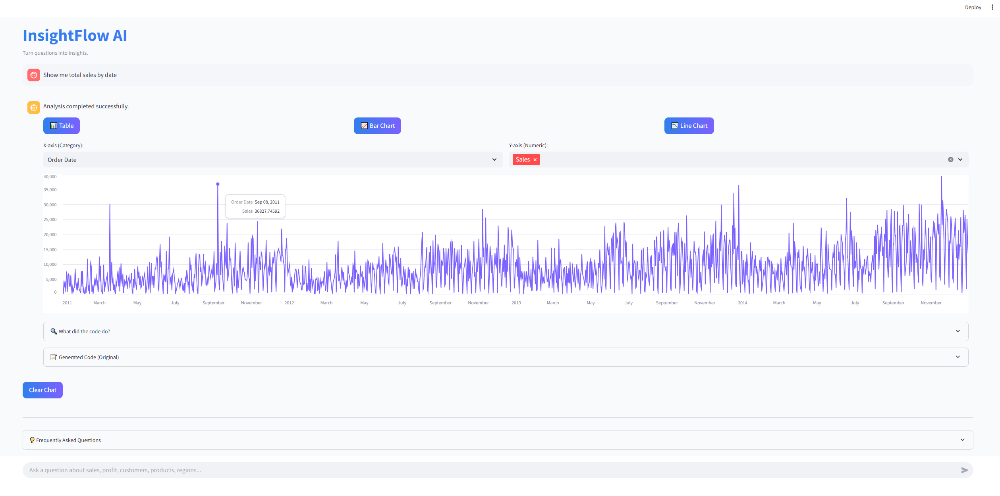
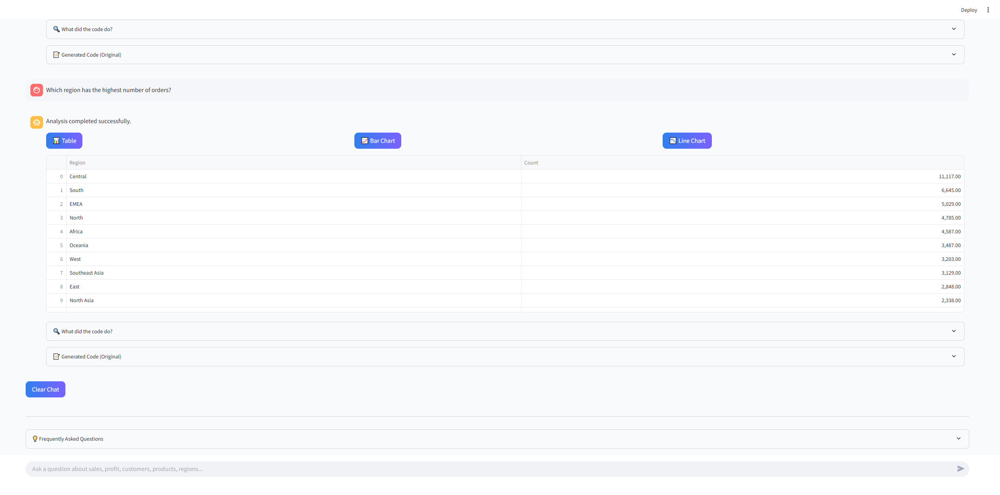
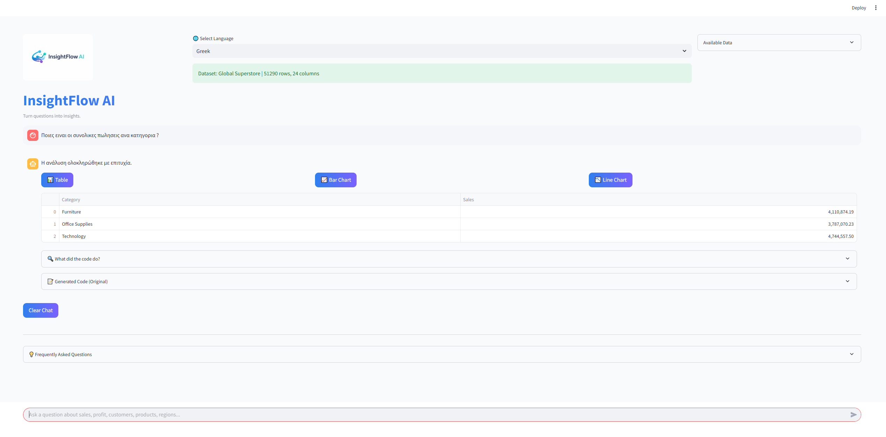

#  


**InsightFlow AI** is an intelligent data analysis web app that turns natural language questions into actionable insights using Python, LLMs, and automated visualizations.

👉 No SQL. No coding. Just ask questions.

## 📸 Screenshots







---

## ✨ Features

- 💬 **Natural Language Queries**  
  Ask questions like *“What are total sales by category?”* and get instant results.

- 📊 **Automatic Data Analysis**  
  Generates and executes Python (pandas/numpy) code dynamically.

- 📈 **Interactive Visualizations**  
  Toggle between:
  - Tables
  - Bar charts
  - Line charts

- 🌍 **Multi-language Support**
  - English
  - Greek
  - Spanish
  - Italian

- 🧠 **AI-Powered Code Generation**
  - Uses local LLMs (via Ollama)
  - Automatically fixes errors in generated code

- 🔍 **Code Transparency**
  - See generated code
  - View explanations of what the code did

- 🧩 **Synonym Mapping**
  - Understands different ways users refer to columns (via Excel config)

---

## 🏗️ How It Works

1. User enters a question in natural language  
2. The app:
   - Loads the dataset (`Global Superstore`)
   - Enhances the query using synonyms  
3. LLM generates Python code to answer the query  
4. Code is:
   - Cleaned  
   - Validated  
   - Executed safely  
5. Results are displayed as:
   - Data tables  
   - Charts (auto-detected)  
6. Explanation is generated for transparency  

---

## 🧠 Tech Stack

- **Frontend/UI:** Streamlit  
- **Data Processing:** Pandas, NumPy  
- **Visualization:** Streamlit charts, Plotly, Altair  
- **LLM Integration:** Ollama (Llama 3.2, DeepSeek Coder)  
- **Translation:** deep-translator  
- **Other:** Matplotlib (fallback), PIL  

---

## 📁 Project Structure
├── InsightFlowAI.py # Main Streamlit app
├── Global_Superstore2.csv # Dataset
├── column_synonyms.xlsx # Optional synonym mapping
├── insightflowAI.png # Logo


## ⚙️ Installation

### 1. Clone the repo

```bash
git clone https://github.com/yourusername/insightflow-ai.git
cd insightflow-ai

pip install -r requirements.txt

ollama run llama3.2
ollama run deepseek-coder:6.7b
```

## ▶️ Run the App
streamlit run InsightFlowAI.py
